```{r setup, include=FALSE}
knitr::opts_chunk$set(echo = TRUE)
library(knitr)

# Ajustar figuras al tamaño de la página
knitr::opts_chunk$set(out.height = "\\textheight",  out.width = "\\textwidth")

```

# Introducción al manual 

Programar es como escribir: cada quien tiene un estilo personal e irrepetible. 

Este manual no pretende establecer un método o estilo único de programación, solo aspira a plantear un esquema de trabajo que facilite el trabajo colaborativo y la transparencia en la investigación. 


# Principios generales

## Trabajo colaborativo 
Al programar, siempre hay que tener en mente que otras personas (incluidas nuestras yo del futuro) podrán acceder a nuestros códigos. Lo mismo sucede con los productos que generemos: bases de datos limpias, visualizaciones o reportes. Por ello, se debe procurar claridad en el código, así como aprovechar las herramientas técnicas (como GitHub o los proyectos de R) que facilitan la colaboración entre distintas programadoras y analistas de datos. 

## Transparencia 

## Reproducibilidad 

## Flujo de código eficiente


# Infraestructura colaborativa (GitHub + RStudio + Proyectos de R)

Antes de comenzar a programar, es necesario tener una infraestructura digital para el almacenamiento y flujo de los datos que permita el trabajo colaborativo con un flujo eficiente. Para ello, la combinación de GitHub y los projectos de R es una gran opción. 

**GitHub** es una plataforma para almacenar código y datos —una combinación entre nubes de almacenamiento (como Dropbox) y redes sociales—. Con su sitio web y la aplicación de GitHub Desktop, Github facitila el uso de __git__, el sistema de control de versiones distribuido que permite sincronizar carpetas de documentos y códigos entre múltiples computadoras. De hecho, para usar GitHub no es necesario saber __git__, como sí lo es necesario para otras plataformas como GitLab. 

**RStudio** es una interfaz para programar en R y en Python. Para programar, es necesario descagar primero R y después RStudio. Una analogía útil para distinguir R (el lenguage de programación) de RStudio (el entorno desarollado integrado) es pensar el primero como un motor y el segundo como la carrocería de un coche. 

Un **[projectos de R](https://respuestasrapidas.com.mx/que-es-un-proyecto-en-r/)** "identifica los archivos de origen y contenido asociados con el proyecto. También contiene información de compilación de cada archivo, mantiene la información para integrarse con sistemas de control de código fuente y ayuda a organizar la aplicación en componentes lógicos."

A continuación, se explica cómo montar la infraestructura digital necesaria para un proyecto colaborativo de datos, usando estas herramientas. 


Cuando se va a iniciar un nuevo proyecto de datos, se deben seguir estos pasos:
1. Crear un repositorio en GitHub 
2. Clonar repositorio en la computadora
3. Crear un proyecto en R dentro del respositorio de GitHub

## Repositorios en GitHub
En GitHub, los proyectos se guardan como repositorios. Los repositorios pueden pensarse como una carpeta de docuemntos que existen de manera simultánea en línea y en los equipos personales de las personas colaboradoras. Los repositorios pueden ser públicos o privados. 


**Término en GitHub** | **Equivalente o definición** | 
__Repositorio__ | Carpeta de archivos |
__Clonar__  | Descargar a un equipo local |
__Fetch__  | Buscar cambios en la versión en línea que no estén presentes |
__Pull__ | Desacargar los cambios en línea a la versión local |
__Commit__ | Hacer una contribución al repositorio |
__Push__ | Subir a internet los cambios presentes en la versión local (contribución) |
__Master__ | |


La siguiente sección también está disponible en la (wiki de Intersecta)[https://github.com/IntersectaOrg/practicas_programacion/wiki] 

### Crear un repositorio 
 Los repositorios de GitHub son equivalentes a una carpeta compartida, todos los archivos del repositorio (o carpeta) estarán disponibles en línea y en las computadoras de las personas que hayan [clonado](https://github.com/IntersectaOrg/programacion/wiki/C%C3%B3mo-clonar-un-repositorio-en-GitHub) el repositorio en sus propios equipos. Los siguientes pasos muestran cómo crear un repositorio en GitHub. 


**1.** Entra a la página de [Intersecta en GitHub](https://github.com/IntersectaOrg).

**2.** Desde la página de inicio de la organización, selecciona el botón de "New" para crear un nuevo repositorio. 

```{r, crear1, echo = F, width = 4, heigth = 3}
include_graphics("../04_figs/repositorio-1.png")
```

**3.** Una vez en el menú para un nuevo repositorio, define el nombre que quieres que tenga (lo recomendado es utilizar guiones en vez de espacios). También puedes añadir una descripción del repositorio que acabas de creer, establecer si el repositorio será público o privado y añadir archivos para la gestión del mismo. 

```{r, crear2, echo = F}
include_graphics("../04_figs/repositorio-2.png")
```

**4.** Ya que estés satisfecha con la configuración de tu repositorio, presiona el botón de "Create repository". 

```{r, crear3, echo = F}
include_graphics("../04_figs/repositorio-3.png")
```

**5.** Felicidades, ¡el repositorio ya existe! 

```{r, crear4, echo = F}
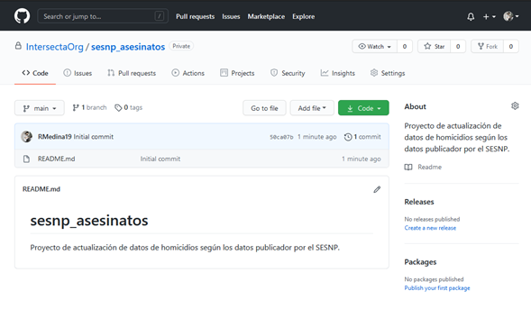
```


Para manejar el nuevo repositorio desde tu computadora, tendrás que clonarlo en tu equipo. Una vez que hayas clonado el repositorio y quieras subir tus primeros documentos.

### Clonar un repositorio
Los repositorios en GitHub son como carpetas compartidas que facilitan el trabajo colaborativo en programación. Si tú o una de tus compañeras ya creó el repositorio de su proyecto, deberás clonarlo en tu computadora para ser capaz de consultar y editar los archivos de manera cómoda. Antes de revisar cómo puedes clonar un repositorio, recuerda que debes tener instalada la aplicación de GitHub Desktop instalada en tu computadora. Si no la tienes, puedes  [descargarla aquí](https://desktop.github.com/).

Estos son los pasos para clonar un repositorio en tu computadora:

**1.** Dirígete a la página del repositorio que deseas clonar. 

**2.** Selecciona el botón de "Code". 

```{r, clonar1, echo = F}
include_graphics("../04_figs/clonar-1.png")
```

**3.** Desde el menú que se despliega, haz click en "Open with GitHub Desktop". 

```{r, clona2r, echo = F}
include_graphics("../04_figs/clonar-2.png")
```

**4.** Es probable que tu equipo te pida especificar con qué aplicación deseas abrir el hipervínculo. Si es el caso, selecciona GitHub Desktop. 

```{r, clonar3, echo = F}
include_graphics("../04_figs/clonar-3.png")
```

**5.** Se abrirá un pequeño panel de control directamente en la aplicación. Aquí puedes seleccionar la ubicación precisa en la que quieres que se ubique la carpeta.  Si estás conforme con la opción predeterminada, basta con que selecciones la opción “Clone”.

```{r, clonar5, echo = F}
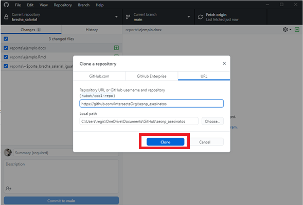
```

**6.** Espera un momento en lo que se clonan los documentos desde el servidor web en la ubicación local de tu computadora. 

```{r, clonar4, echo = F}
include_graphics("../04_figs/clonar-4.png")
```

**7.** ¡Ya está clonado el repositorio en tu computadora! Así se verá desde el panel de control de GitHub Desktop. 

```{r, clonar6, echo = F}
include_graphics("../04_figs/clonar-6.png")
```

**8.** Para consultar y modificar los archivos, dirígete a la ubicación de tu computadora que hayas escogido para el repositorio. ¡La carpeta ya estará ahí!

```{r, clonar7, echo = F}
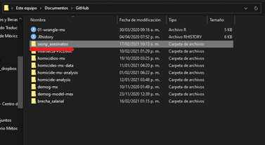
```

Ahora que tienes el repositorio en tu equipo, es probable que quieras __crear un proyecto en R__ para comenzar a trabajar en caso de que sea un repositorio nuevo o, en caso de que se trate de un repositorio preexistente, que desees comenzar a trabajar con los archivos y __commit__. 


### Hacer una contribución a un repositorio 

Si estás aquí es porque ya cuentas con el repositorio de tu proyecto en tu propio equipo de cómputo, ya sea que sea [recién creado ](https://github.com/IntersectaOrg/programacion/wiki/C%C3%B3mo-crear-un-repositorio-en-GitHub)o [sólo clonado](https://github.com/IntersectaOrg/programacion/wiki/C%C3%B3mo-clonar-un-repositorio-en-GitHub). También debes tener ya un [proyecto de R ](https://github.com/IntersectaOrg/programacion/wiki/C%C3%B3mo-crear-un-proyecto-en-R) desde el que se gestionan todos los códigos y documentos. Ahora que está todo listo, puedes comenzar a trabajar y hacer la programación del código que necesites. Una vez que estés satisfecha con los resultados de tu trabajo, querrás sincronizar los códigos y documentos en el _master_ para que el resto de tus compañeras vea tu trabajo. Sincronizar los documentos con git es bastante sencillo cuando utilizas la aplicación de escritorio de GitHub (si no la tienes, [descárgala aquí ](https://desktop.github.com/)).

Aquí están los pasos para hacer tu contribución desde GitHub Desktop: 

**1.** Revisa la carpeta correspondiente al repositorio de tu proyecto y asegúrate de que todos los documentos (códigos, bases de datos, reportes, etcétera) estén ordenados tal cual como deseas subirlos. 

```{r, commit2, echo = F}
include_graphics("../04_figs/commit-2.png")
```
**Nota:** Estos cambios y archivos se encuentran sólo en tu computadora, el repositorio en línea no está actualizado. Como puedes ver, los archivos de la computadora no están en línea (aún).   

```{r, commit1, echo = F}
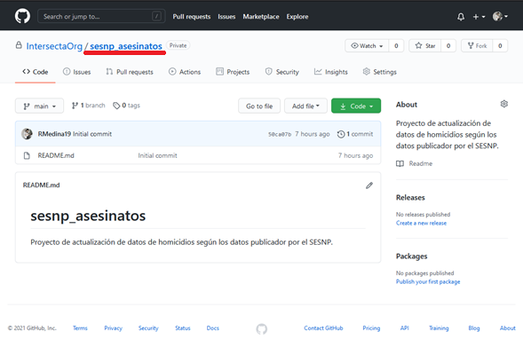
```


**2.** Abre GitHub Desktop. Selecciona la pestaña de “Current repository”.

```{r, commit3, echo = F}
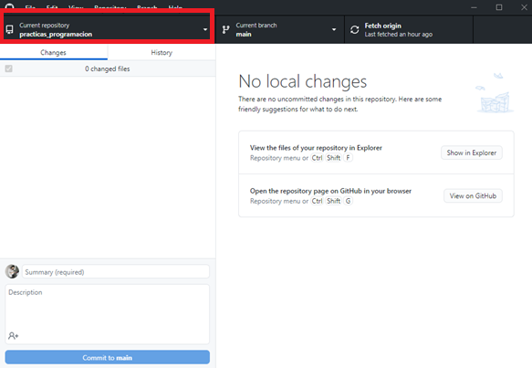
```

**3.** Selecciona el repositorio en donde estuviste trabajando y que ahora quieres actualizar. 

```{r, commit4, echo = F}
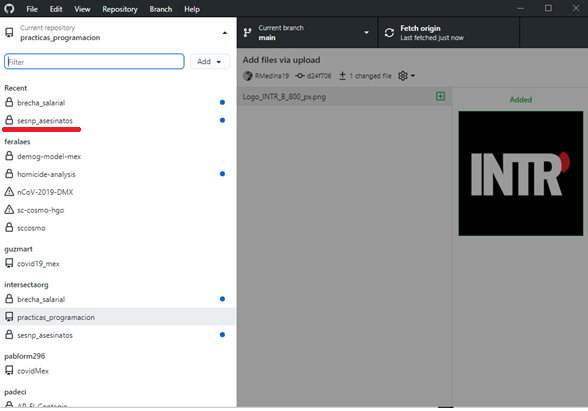
```

**4.** En el panel verás todos los cambios que hayas realizado. Selecciona sólo los cambios que deseas subir al repositorio en línea. En este caso, subiremos el proyecto de R, el código de limpieza de los datos, la base de datos cruda, la base de datos limpia y el archivo de R Markdown para generar un reporte. 

```{r, commi5t, echo = F}
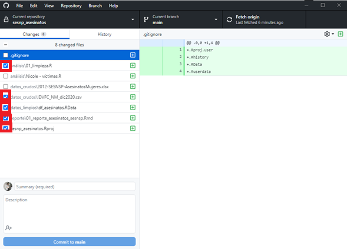
```

**5.** Una vez que hayas seleccionado los archivos que deseas subir, añade un resumen y una descripción para tu contribución. 

```{r, commit6, echo = F}
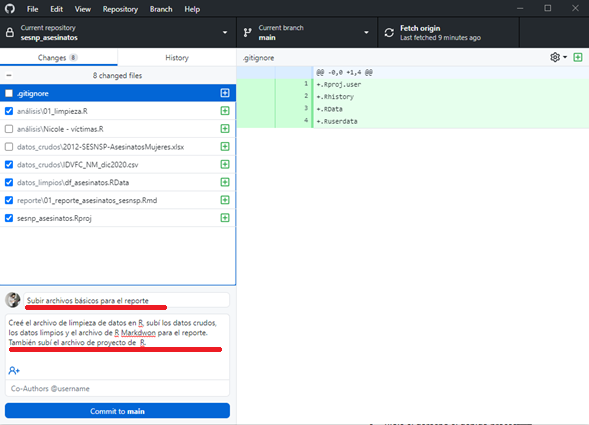
```

**6.** Presiona “Commit to main”.

```{r, commit7, echo = F}
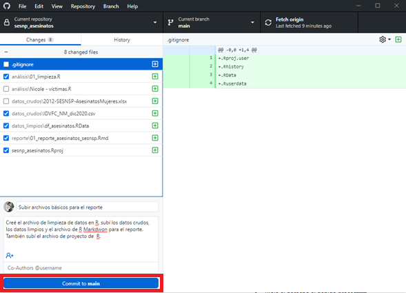
```

**7.** Los archivos se procesarán y cargarán, ahora sólo presiona “Push origin” para sincronizar la contribución. 

```{r, commit9, echo = F}
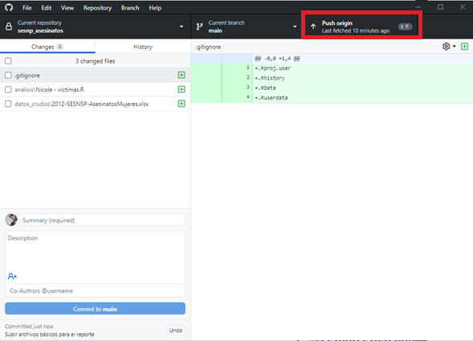
```

**8.** ¡Tus archivos locales ya están en línea! Recuerda avisar a tus compañeras que hagan el pull request para que tengan tus documentos actualizados en sus propias computadoras.

```{r, commit10, echo = F}
include_graphics("../04_figs/commit-10.png")
```


## Proyectos de

### Cómo crear un proyecto en R 

Utilizar proyectos de R facilita el trabajo de programación pues sincroniza las direcciones de los archivos que utilizará y generará tu código. Combinado con los repositorios de GitHub, los proyectos de R permiten un trabajo mucho más eficiente. Si ya [creaste un repositorio](https://github.com/IntersectaOrg/programacion/wiki/C%C3%B3mo-crear-un-repositorio-en-GitHub) y lo [clonaste en tu equipo](https://github.com/IntersectaOrg/programacion/wiki/C%C3%B3mo-clonar-un-repositorio-en-GitHub) es momento de crear un proyecto de R para el mismo. Aquí están los pasos para hacerlo: 

**1.** Abre RStudio en tu computadora. 


**2.** Selecciona la pestaña de "File". 


```{r, proyector1, echo = F}
include_graphics("../04_figs/proyector-2.png")
```

**3.** Presiona "New Project"

```{r, proyector2, echo = F}
include_graphics("../04_figs/proyector-2.png")
```

**4.** Se abrirá un menú para los nuevos proyectos. Como ya debes tener el repositorio del proyecto clonado en tu computadora, selecciona la opción de "Existing Directory". 

```{r, proyector3, echo = F}
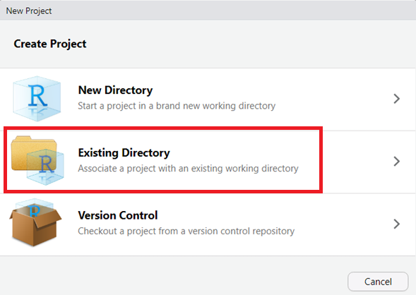
```

**5.** Ahora es necesario indicar dónde se ubicará el proyecto. Para esto, selecciona el botón de "Browse". 

```{r, proyector4, echo = F}
include_graphics("../04_figs/proyector-4.png")
```

**6.** El explorador de archivos debe haberse abierto, ubícate en la carpeta de tu computadora que corresponde al repositorio de tu proyecto y selecciona "Open". 

```{r, proyector5, echo = F}
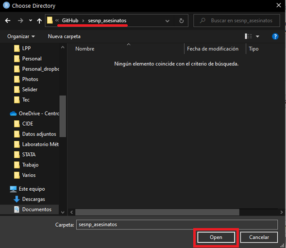
```

**7.** Una vez que la dirección haya cambiado a la carpeta del repositorio deseado, selecciona el botón de "Create Project". 

```{r, proyector6, echo = F}
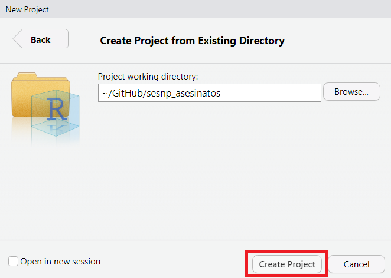
```

**8.** ¡Tu proyecto ya existe! Tu RStudio ahora se ubicará en ese proyecto, después, podrás acceder a él desde la carpeta de archivos.  

```{r, proyector7, echo = F}
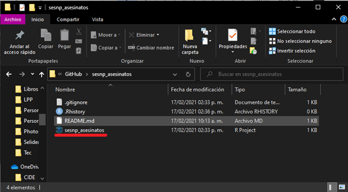
```

No olvides hacer tu [contribución en GitHub](https://github.com/IntersectaOrg/practicas_programacion/wiki/C%C3%B3mo-hacer-una-contribuci%C3%B3n-desde-mi-computadora-al-repositorio-compartido-de-GitHub-(pull-y-push-requests)) para que el nuevo archivo se sincronice en el _master_ del repositorio para que tus compañeras puedan ver el proyecto que acabas de crear. 


## Estructura de carpetas del repositorio

Cada repositorio se organiza de una manera similiar, lo que facilita el flujo de código. 

`00_documentción`
`01_códigos`
`02_datos_crudos`
`03_datos_limpios`
`04_figuras`
`05_reportes`


```{r diagrama1, echo = F}
include_graphics("diagrama_estructura_repo.png")
```


## Almacentamiento de información 

# Código 

## Documentación 

La _documentación_ se refiere a la información que acompaña a un código para pueda ser comprendido por cualquier persona que lo consulta (ya sea una persona que no conoce el código o tu yo del futuro). Documentar implica explicar qué se hace y por qué, en vez de solo hacer (programar). 


Cada código debe incluir un encabezado que provea información sobre el proyecto al que pertenece, su objetivo específico, la persona encargada de su elaboración, así como su fecha de creación y actualización.

Debajo del encabezado, el código puede incluir notas específicas (como acciones pendientes, aclaraciones sobre el procesamiento realizado o advertencias sobre el uso del código). 

Todas las líneas de código que correspondan al encabezado y a las notas deben ir comentadas. Para comentar cualquier código, se debe incluir un signo de número al inicio de la línea (\verb|#|). Esto hará que \verb|R| no arroje un error a la hora de correr la línea en cuestión y que no se interrumpla el flujo de código. 

Una vez que el encabezado está hecho, los códigos deben seguir una estructura jerárquica de apartados que distingan las distintas secciones del código, según las funciones. 


\verb|RStudio| tiene la ventaja de generar índices del código de manera automática, los cuales se pueden mostrar tanto en la columna derecha del visualizador del código, como en una pestaña desplegable debajo del mismo. Para generar un título o subtítulo se debe comenzar con un signo de número (\verb|#|) y terminar con mínimo cuatro guiones (\verb|----|). El nivel que tenga el título o el subtítulo dependerá del número de signos de gato (\verb|#|) que se incluyan al principio de la línea. Esta no es la única forma de generar títulos, pero es la recomendada dentro de este estilo gracias a su armonía visual. 

Además 
  poner \verb|----|. hasta que se alcancen 80 caracteros
  numerar manualmente los niveles de los títulos y subtítulos


Algunos de los ejemplos más frecuentes de los encabezados que se usan en los códigos 

- Establecer configuración inicial de código (indispensable) 
- Definir funciones 
- Cargar datos 
- Procesar datos
- Aplicar diseño de encuesta 
- Crear gráficas 
- Guardar datos 


La siguiente es una plantilla de cómo se ve la estructura general de la documentación de un código en el que se cargan datos, se procesan, visualizan y guardan. 

```{r plantilla}
#------------------------------------------------------------------------------#
# Proyecto:               
# Objetivo:               
#
# Encargada(s):             
# Correo(s):                 
# Fecha de creación:      
# Última actualización:   
#------------------------------------------------------------------------------#

# NOTA: 

# FUENTE: 

# 0. Configuración inicial -----------------------------------------------------
# 1. Cargar datos --------------------------------------------------------------
# 2. Procesar datos ------------------------------------------------------------
# 3. Gráficas ------------------------------------------------------------------
## 3.0. Configuración de gráficas ----------------------------------------------
## 3.1. Primer grupo de visualizaciones ----------------------------------------
### 3.1.1. Cruces por variable 1 -----------------------------------------------
### 3.1.2. Cruces por variable 2 -----------------------------------------------
## 3.2. Segundo grupo de visualizaciones ---------------------------------------
### 3.2.1. Cruces por variable 1 -----------------------------------------------
### 3.2.2. Cruces por variable 2 -----------------------------------------------
## 4. Guardar datos ------------------------------------------------------------
# FIN. -------------------------------------------------------------------------

```


## Nombrar objetos (estilo Alarid-Escudero)

## Funciones de directorios 
## Sintaxis tidyverse 
## Importación de datos 
### Desde el repositorio en GitHub
### Desde una carpeta en Google Drive
### Desde la API del INEGI

## Visualizaciones


# Tips para buscar ayuda 
## Documentación de funciones y paquetes en R 
## StackOverflow 
